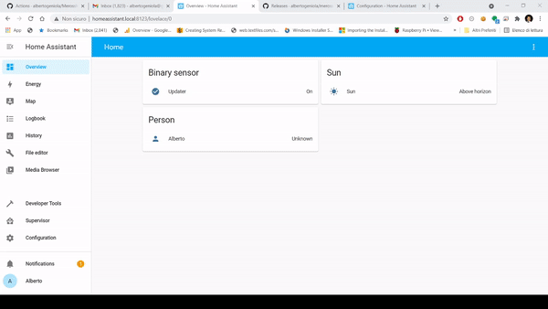
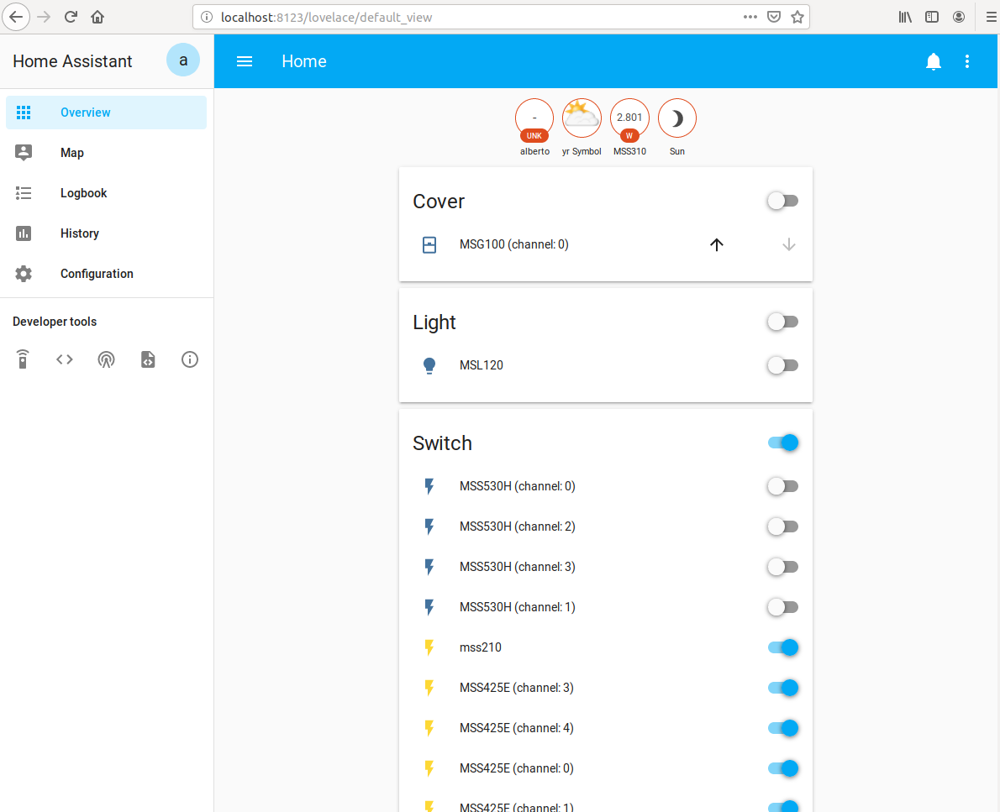
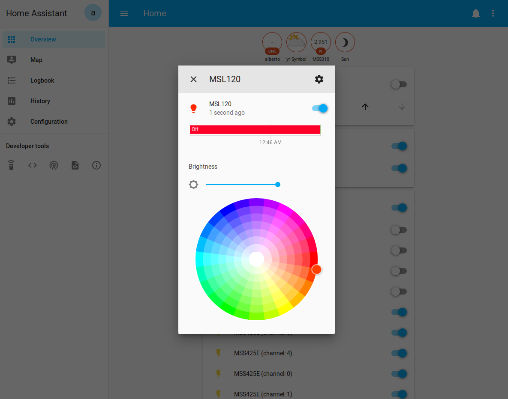
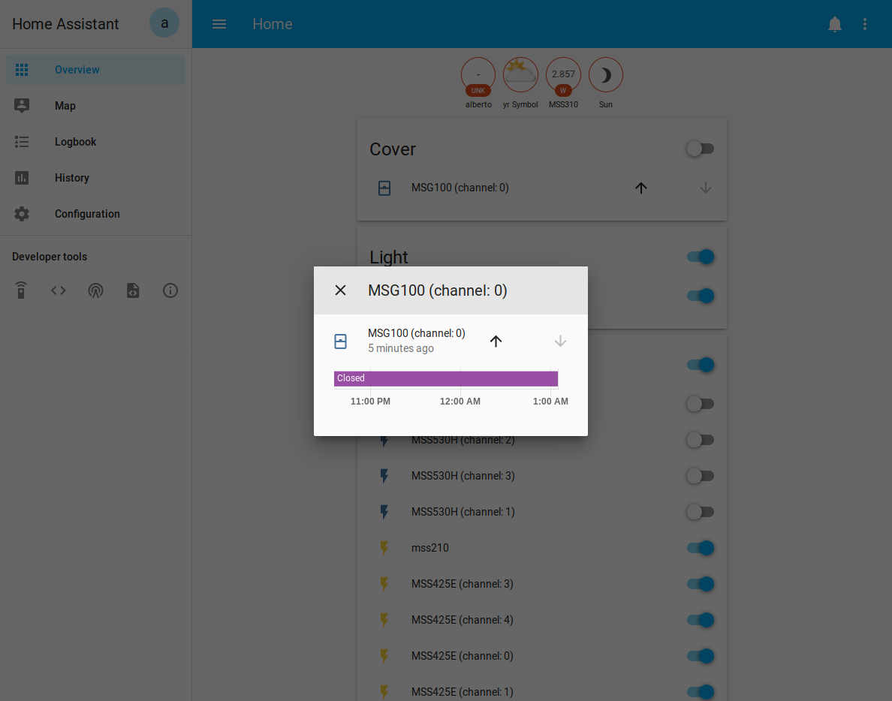
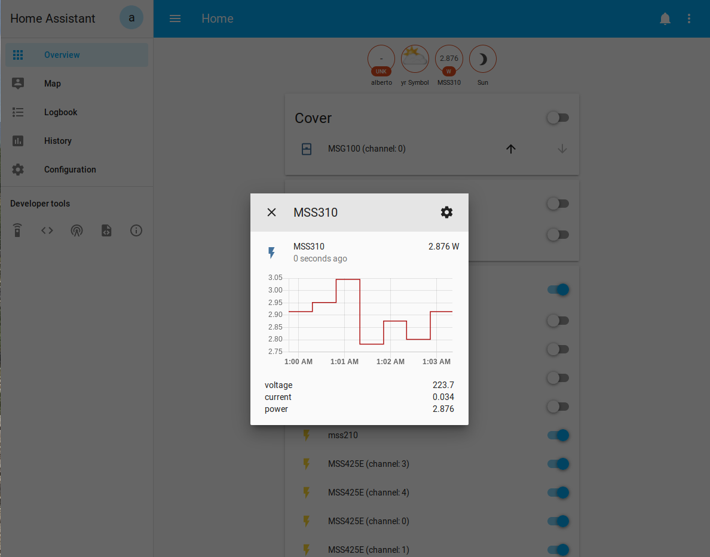
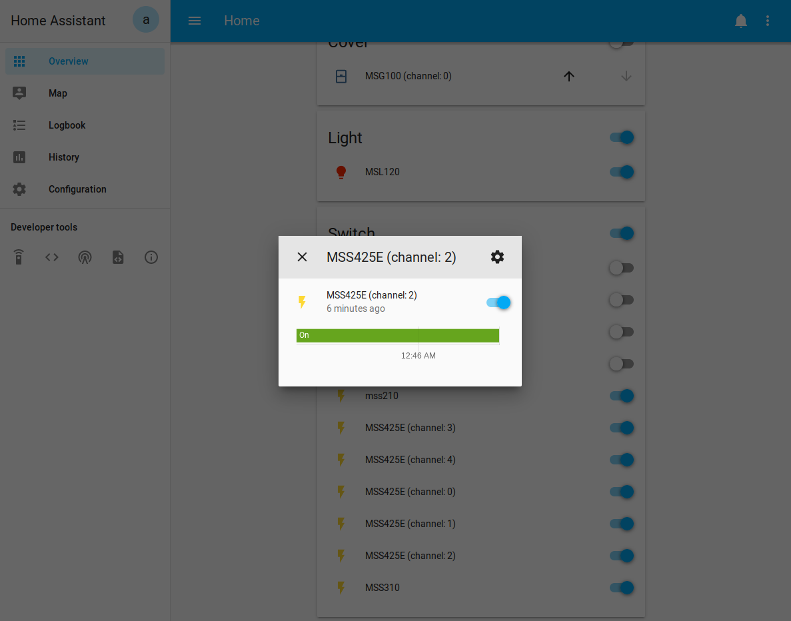

[](https://hacs.xyz/docs/faq/custom_repositories)
[](https://github.com/fabilau/meross-hass/releases/latest)

# Meross Integration for Home Assistant
A Home Assistant custom integration to control Meross smart devices via the Meross Cloud (MQTT push + HTTP API).
The low-level Meross protocol library is bundled with the integration, so no extra Python packages need to be installed.

## ✨ What's New in v1.4.0
- **🛡️ 24/7 stability & freeze fixes**: Resolved the daily connection freezes where devices stopped responding and the integration had to be restarted. Added strict 15s connection timeouts, thread-safe MQTT disconnect handling, exponential reconnect backoff, debounce protection against reconnect storms, cleanup of pending futures and an automatic health-check watchdog.
- **🚨 GS559A smart smoke & heat alarm support**:
  - Binary sensors: smoke alarm, heat alarm, sensor fault, test mode, muted state
  - Diagnostic status sensor with numeric and descriptive states
  - Buttons: test alarm sound, mute/silence alarm
  - Battery level
- **🚪 MS200 door & window sensor support**:
  - Instant push binary sensor (open/closed) with timestamp attributes
  - Battery level
- **🩺 Hardware diagnostic tool**: Validate your devices and watch live MQTT push events with `python3 tools/meross_diagnostic.py`.

See [CHANGELOG.md](CHANGELOG.md) for the full history.

## Supported devices
Devices are detected by the capabilities they report to the Meross cloud, so most current Meross products work out of the box:

| Device type                          | Home Assistant platforms            |
|--------------------------------------|-------------------------------------|
| Smart plugs & power strips (incl. energy metering) | `switch`, `sensor`        |
| Light bulbs & LED strips             | `light`                             |
| Garage door openers, roller shutters | `cover`                             |
| Thermostats & radiator valves        | `climate`                           |
| Humidifiers & diffusers              | `humidifier`, `light`               |
| Hub sub-devices: MS100 (temperature/humidity), MS200 (door/window), GS559A (smoke/heat) | `sensor`, `binary_sensor`, `button` |

## Installation

### Option A: HACS (recommended)
1. In Home Assistant open **HACS → ⋮ → Custom repositories**.
2. Add `https://github.com/fabilau/meross-hass` with category **Integration**.
3. Search for **Meross Integration** and click **Download**.
4. **Restart Home Assistant.**

### Option B: Manual installation
1. Download the latest release archive from the [releases page](https://github.com/fabilau/meross-hass/releases/latest).
2. Copy the `custom_components/meross_cloud` directory into the `custom_components` directory of your Home Assistant configuration directory (the one containing `configuration.yaml`). Create `custom_components` if it does not exist:
    ```
    config/
    ├── configuration.yaml
    └── custom_components/
        └── meross_cloud/
            ├── __init__.py
            ├── manifest.json
            └── ...
    ```
3. **Restart Home Assistant.**

## Configuration
Go to **Settings → Devices & Services → Add Integration** and search for **Meross Cloud IoT**.
The setup wizard asks for the following values:

| Field                            | Example                      | Description |
|----------------------------------|------------------------------|-------------|
| HTTP API Endpoint                | `https://iotx-eu.meross.com` | Meross API endpoint for your region: <br/>- `https://iotx-eu.meross.com` (Europe) <br/>- `https://iotx-us.meross.com` (United States) <br/>- `https://iotx-ap.meross.com` (Asia/Pacific) |
| Email Address                    | `user@example.com`           | The email address of your Meross account (same as in the Meross app). |
| Password                         | `••••••••`                   | The password of your Meross account. |
| MQTT Address                     | `mqtt.meross.com:443`        | MQTT broker address (`host:port`). Pre-filled with the broker of your Meross account; only change it for a self-hosted broker. |
| Skip MQTT certificate validation | unchecked                    | Disables TLS certificate validation of the MQTT broker. Keep unchecked for the official Meross cloud; only enable it for self-hosted brokers with self-signed certificates. |

Your password is only used to obtain a session token; Home Assistant stores the token, not the password. If the token expires or your password changes, Home Assistant will ask you to re-authenticate.



### Options
After setup, the integration options (**Configure** button) let you set:
- **Device communication**: MQTT only, or prefer local LAN HTTP with MQTT fallback.
- **Custom HTTP user agent** used for API polling.

### API rate limits
Meross enforces rate limits on its cloud API and MQTT broker. Avoid high-frequency polling scripts or automations, especially with many devices; the integration is push-based and does not need them.

<details>
    <summary>Screenshots</summary>






</details>

## Diagnostic tool
`tools/meross_diagnostic.py` logs into your Meross account, lists all discovered devices and prints live MQTT push events, which helps when verifying new hardware or reporting bugs:

```bash
python3 tools/meross_diagnostic.py --email "user@example.com"   # password is prompted
python3 tools/meross_diagnostic.py --listen 30                   # listen for push events for 30 s
python3 tools/meross_diagnostic.py --dump                        # writes meross_discovery_dump.json
```

Credentials can also be passed via the `MEROSS_EMAIL` and `MEROSS_PASSWORD` environment variables.

## Troubleshooting
To enable debug logging, add the following to `configuration.yaml` and restart Home Assistant:

```yaml
logger:
  default: warning
  logs:
    custom_components.meross_cloud: debug
```

> ⚠️ Debug logs can contain account and device information. Review and redact them before sharing.

Bugs and feature requests: [GitHub issues](https://github.com/fabilau/meross-hass/issues).

## Development
```bash
python3 -m venv .venv && source .venv/bin/activate
pip install pytest pytest-asyncio
pytest tests/
```

## License
MIT, see [LICENSE](LICENSE).
